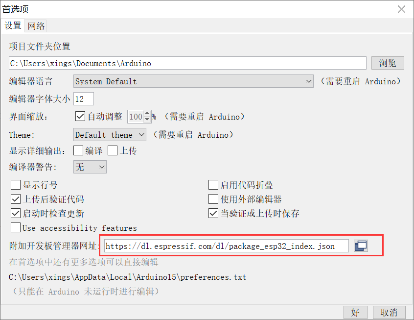
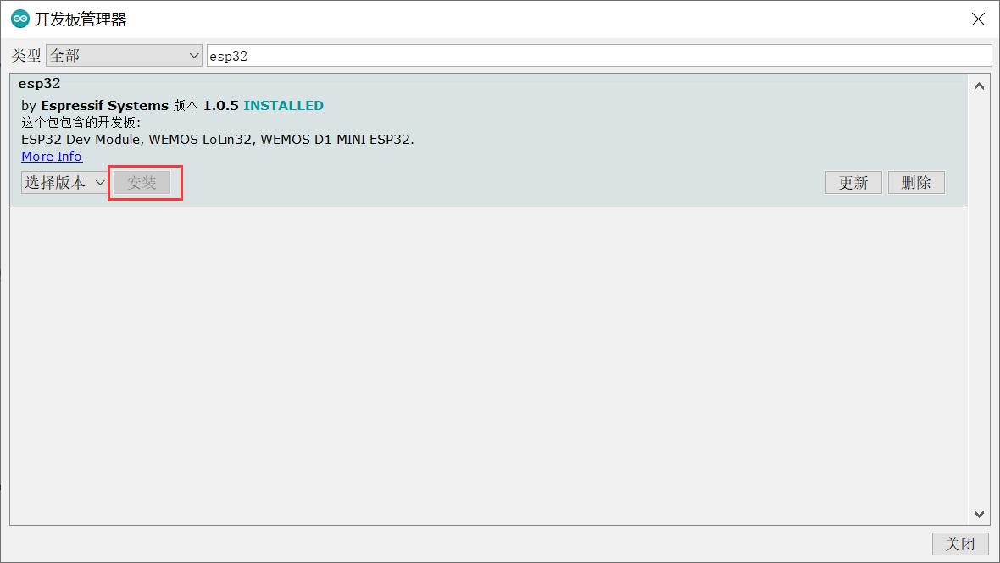
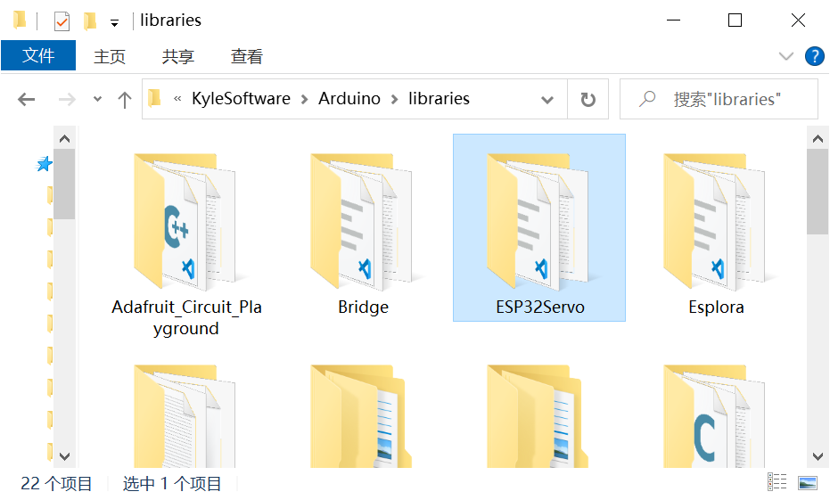

# Arduinio-ESP32开发环境配置

[toc]

## 准备工作

* 安装Arduino IDE

  https://www.arduino.cc/en/Main/Software_

* 安装ESP32开发板的USB转UART驱动

  CH340的驱动下载地址

  http://www.wch.cn/download/ch341ser_exe.html


## 安装ESP32的拓展包

文件-> 首选项 -> 附加开发板管理器网址， 粘贴网址

```
https://dl.espressif.com/dl/package_esp32_index.json
```




工具 -> 开发板 -> 开发板管理器， 搜索"esp32"

找到乐鑫官方的库，安装.



> 注:  如果加载过慢， 可能需要使用lantern翻墙安装， 设置全局代理。 个人有一定量的免费额度， 安装好ESP32的开发环境是够用了。  https://getlantern.org/en_US/index.html

## 安装Arduino库

将依赖包放置到Arduino安装路径下的libraries文件夹下. 




* ESP32Servo - ESP32舵机控制包

  https://github.com/jkb-git/ESP32Servo

