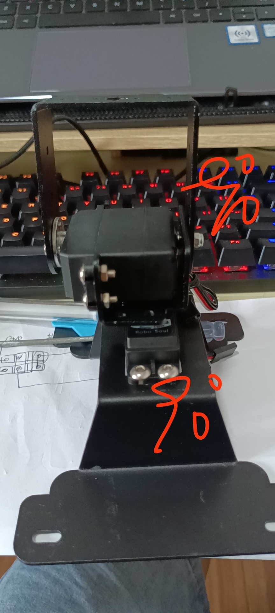
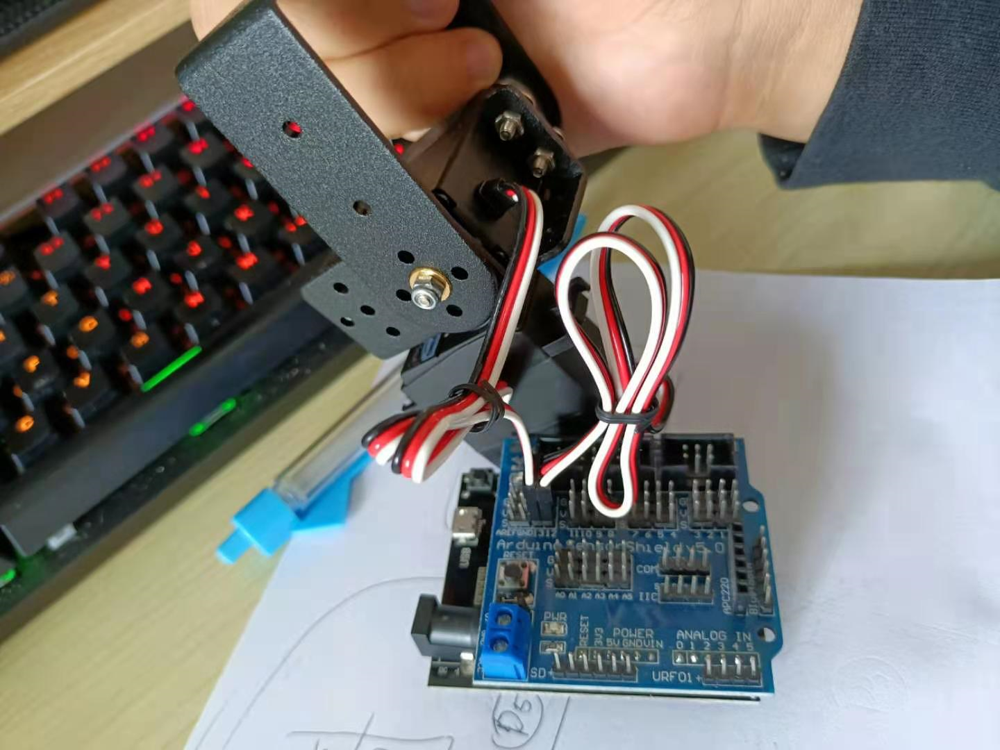

# 舵机云台人脸跟踪使用说明

[toc]


## 舵机云台安装

> 若云台已装好则跳过此步骤。

给ESP32烧录固件`src/arduino-esp32/gimbal_install`

安装舵机云台, 上下舵机都是设置为90度。





**接线说明**

| Arduino 传感器拓展板 | ESP32   | 舵机      |
| -------------------- | ------- | --------- |
| GPIO 12              | GPIO 19 | 下方舵机  |
| GPIO 13              | GPIO 18 | 上方舵机. |



## 舵机云台串口通信

ESP32烧录固件`src/arduino-esp32/gimbal_uart_protocol`

通信协议说明

```
下舵机角度,上舵机角度\n
```

示例:

```
90.0,120.0\n
```


## 修改串口的配置文件

修改文件 `src/pc/gimbal_uart_protocol.py`

配置ESP32设备号

```python
GIMBAL_UART_PORT = 'COM5' # 舵机串口号
```

## 修改摄像头的配置文件

修改文件`config/camera.yaml`

修改摄像头的ID， 默认为0

```yaml
#############################
## 相机的默认参数
#############################
# 摄像头的设备号
# 默认为 0:  /dev/video0
device: 0  
# 画面宽度
img_width: 640
# 画面高度 
img_height: 480
# 相机帧率
fps: 30
# 图像缓冲区的尺寸
buffer_size: 2
```

## 舵机云台视觉跟踪

执行`src/pc/gimbal_face_track.py`

```
python gimbal_face_track.py
```

## 联系作者

作者: 阿凯爱玩机器人

微信: xingshunkai

邮箱: xingshunkai@qq.com

更新日期: 2022/03/03
