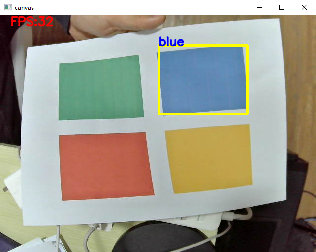

# 舵机云台色块跟踪使用说明


## 前言

本文介绍如何使用舵机云台色块追踪功能。

舵机云台安装， 串口通信见文档**舵机云台人脸跟踪使用说明**。 


## 修改串口的配置文件

修改文件 `src/pc/gimbal_uart_protocol.py`

配置ESP32设备号

```python
GIMBAL_UART_PORT = 'COM5' # 舵机串口号
```

## 修改摄像头的配置文件

修改文件`config/camera.yaml`

修改摄像头的ID， 默认为0

```yaml
#############################
## 相机的默认参数
#############################
# 摄像头的设备号
# 默认为 0:  /dev/video0
device: 0  
# 画面宽度
img_width: 640
# 画面高度 
img_height: 480
# 相机帧率
fps: 30
# 图像缓冲区的尺寸
buffer_size: 2
```

## 打印色板

在`assert/` 文件夹下， 将`卡片-色块RGBY.pdf` 打印出来 


可以裁剪为卡片。

## 采集颜色样本

执行相机GUI软件， 采集不同颜色的矩形色块（ROI区域）。

```bash
python gui_camera.py
```


点击选择保存路径， 选择相对路径`data/roi_image/<选择一个颜色>`


例如想更新蓝色卡片的阈值， 就打开`blue` 文件夹。操作前可以把原来的blue文件夹里面的图片删掉。


把色块放置到摄像头视野中， 用矩形框选中该色块， 确保矩形框中都是该颜色。


点击保存ROI图像即可。

 理论上采集一张即可， 也可以采集多张。

其他颜色也一样。


## 运行色块跟踪脚本

修改源码 `cv_color_track.py` 主程序位置，配置主程序里面要跟踪的色块颜色名称

```python
if __name__ == "__main__":
	# 要识别的颜色
	# 颜色可选范围 “red”, “green”, "blue", "yellow"
	TARGET_COLOR = "blue"
```

运行脚本

```
 python .\cv_color_track.py
```




## 云台色块跟踪

执行脚本

```bash
python gimbal_color_track.py
```

## 联系作者

作者: 阿凯爱玩机器人

微信: xingshunkai

邮箱: xingshunkai@qq.com

更新日期: 2022/03/03